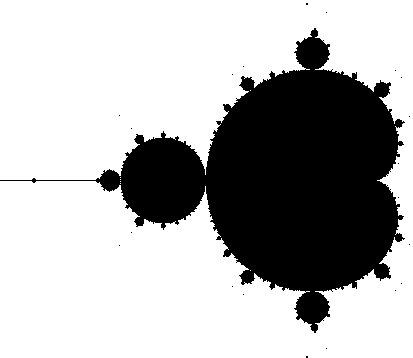
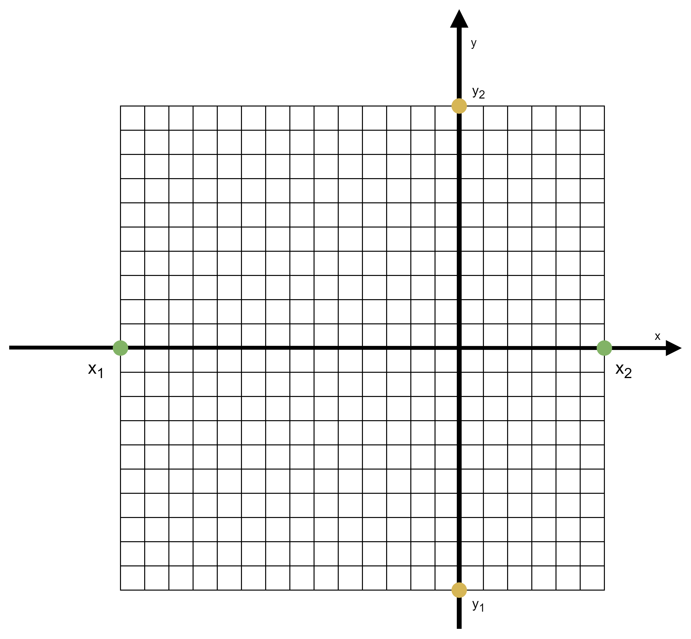
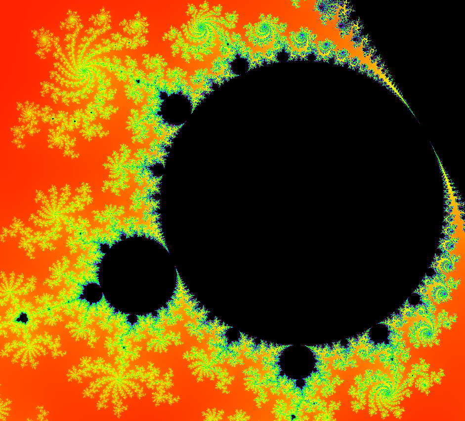
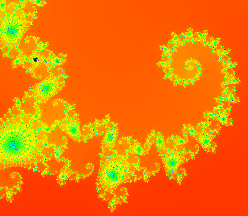
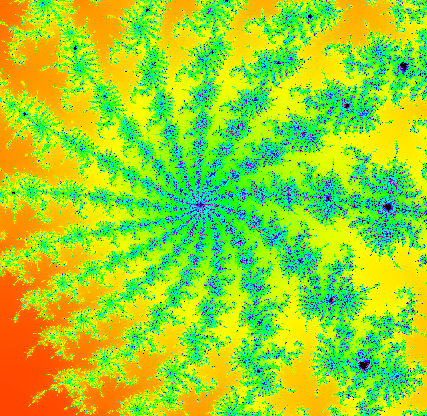
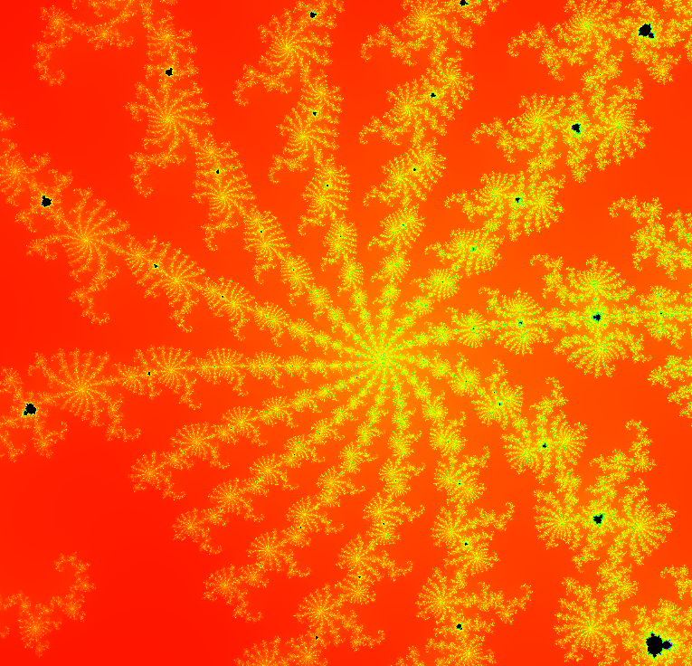
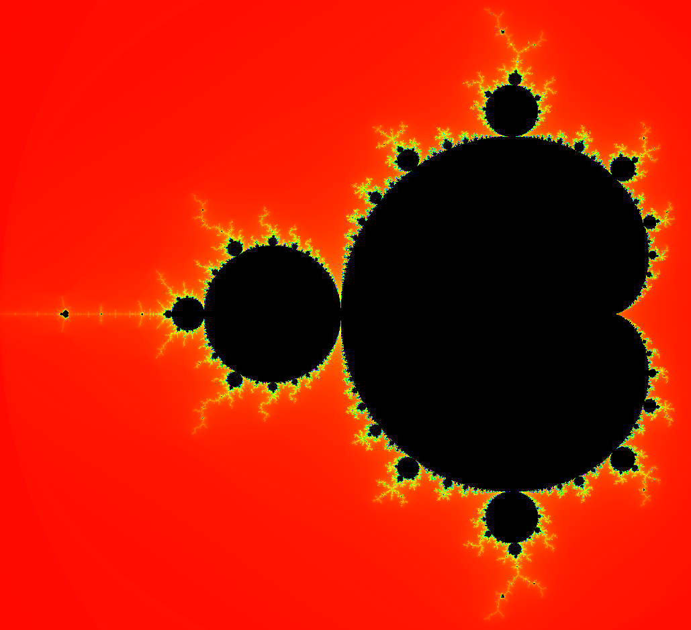

# Mandelbrot Set
The Mandelbrot Set is a fractal named after Benoit B. Mandelbrot, defined by the recursive function $z_{n+1} = z_n^2 + c$, where $z$ and $c$ are complex numbers. 
Starting with $z_0 = 0$, the complex number $c$ belongs to the Mandelbrot set if the sequence $z_n$ is bounded as $n \to \infty$.
For example, the point $c = 1$ is not a member of the Mandelbrot set because for $c = 1$, the sequence $0, 1, 2, 5, 26$ grows without bound. The point $c = -1$ is a member of the Mandelbrot set because the sequence $0, -1, 0, -1, 0, \ldots$ is bounded. 
Theorem 1 will help us in visualizing the fractal.

**Theorem 1.** The complex number $c$ belongs to the Mandelbrot set if and only if $|z_n| \leq 2$ for every $n \geq 1$.


Each pixel of the image represents a point in the coordinate system, and for that point, we test if $|z_n| \leq 2$ after $n_\text{max}$ iterations.
If we color the points that belong to the set in black and the points that do not belong to the set in white, we will get the image shown below.

<p>
   
</p>

## Maping the pixels into the coordinate system


<p>
   
</p>

To map pixels into the coordinate system, we use the line equation. 
Let the image $I$ have dimensions $w \times h$. Let $(x_1, y_1)$ and $(x_2, y_2)$ be the starting and ending points of the coordinate system into which the image should be mapped, as shown in the figure above.
Each pixel $(i, j)$ should represent a point $(x, y)$ in the coordinate system. For example, the pixel $(0, 0)$ is mapped to $(x_1, y_1)$.

The interval $[0, w]$ should be mapped to $[x_1, x_2]$, and the interval $[0, h]$ should be mapped to $[y_1, y_2]$. We define the mappings $f_x$ and $f_y$ for these intervals.

$$f_r : [0, w] \rightarrow [x_1, x_2]$$
$$f_c : [0, h] \rightarrow [y_1, y_2]$$


For the coordinates $x$, we have:
$$ f_x(0) = x_1 $$

$$f_x(w) = x_2 $$

The linear transformation for the coordinates $x$ can be obtained as the equation of the line passing through the points $(0, x_1)$ and $(w, x_2)$.

$$\frac{i - 0}{w - 0} = \frac{x - x_1}{x_2 - x_1}$$

Solving for $x$ we get

$$\frac{i - 0}{w - 0} = \frac{x - x_1}{x_2 - x_1} \implies \frac{i}{w} = \frac{x - x_1}{x_2 - x_1} \implies x - x_1 = \frac{i}{w} (x_2 - x_1) \implies x = \frac{i}{w} (x_2 - x_1) + x_1$$

In an analogous way we get

$$y = \frac{j}{w} (y_2 - y_1) + y_1$$

Finally, the pixel $(i, j)$ is mapped to the point $(x, y)$ in the coordinate system using the following formulas:

$$x = \frac{i}{w} (x_2 - x_1) + x_1$$
$$y = \frac{j}{h} (y_2 - y_1) + y_1$$

## Coloring the Mandelbrot

The coloring of the Mandelbrot set involves assigning colors to points in the complex plane based on how quickly the sequence $z_n$ tends to infinity. 
We need a number $t$ from 0 to 1 to represent this speed. This value is then converted to the HSV color space and then to RGB.


There are many ways to calculate the number $t$. Let $n_\text{max}$ be the maximum number of iterations. 
Let $n$ be the iteration number at which $z_n$ either escapes from the Mandelbrot set ($n < n_\text{max}$) or remains within the set and does not escape ($n = n_\text{max}$).
The most basic way to calculate the number $t$ is:

$$t = \frac{n}{n_{\text{max}}}$$

Another method is to use the formula known as the normalized iteration count.

$$s = n + 1 - \frac{\log(\log(|z_n|))}{\log(2)}$$

The value $s$ is normalized with respect to the maximum number of iterations:

$$t = \frac{s}{n_{\text{max}}}$$

Let the color triplet in the HSV color space be $(H_{HSV}, S_{HSV}, V_{HSV})$, where $H_{HSV}, S_{HSV}$, and $V_{HSV} \in [0,1]$.
In our case, the hue value will be $H = t$, the saturation $S_{HSV} = 1$, and the value $V_{HSV} = 1$. 
The conversion of this triplet to the RGB color space is done as follows [@hsv_rgb]:

$$\begin{aligned}
H' &= (6 \cdot H_{HSV}) \mod 6  \\
c_1 &= \lfloor H' \rfloor, \quad c_2 = H' - c_1 \\
x &= (1 - S_{HSV}) \cdot v \\
y &= (1 - (S_{HSV} \cdot c_2)) \cdot V_{HSV} \\
z &= (1 - (S_{HSV} \cdot (1 - c_2))) \cdot V_{HSV}
\end{aligned}$$

Based on the value of $c_1$, the normalized values $R', G', B' \in [0,1]$ are calculated from $v = V_{HSV}$, $x$, $y$, and $z$ as follows:

$$(R', G', B') = 
\begin{cases}
    (v, z, x) & \text{if } c_1 = 0 \\
    (y, v, x) & \text{if } c_1 = 1 \\
    (x, v, z) & \text{if } c_1 = 2 \\
    (x, y, v) & \text{if } c_1 = 3 \\
    (z, x, v) & \text{if } c_1 = 4 \\
    (v, x, y) & \text{if } c_1 = 5.
\end{cases}$$

\
Finally, the RGB values are scaled to integers in the range $[0, N - 1]$ (usually $N = 256$).

$$R = \min(\text{round}(N \cdot R'), N - 1),$$
$$G = \min(\text{round}(N \cdot G'), N - 1),$$
$$B = \min(\text{round}(N \cdot B'), N - 1).$$

After zooming into the fractal, the colors appear as shown in the figure.

<div>
  <p>
    
    
    
    
  </p>
</div>

## Kernel

The following kernel generates an image of the Mandelbrot set. Each thread corresponds to a pixel in this image.
Initially, the complex coordinates of each pixel are calculated based on the thread index.
Then the iteration begins using the Mandelbrot formula to determine if a pixel escapes from the set within a certain number of iterations. 
RGB colors are assigned based on the iteration number at which $z_n$ terminates, and the colors are stored in an output array for visualization.

```
       __global__ void kernel(uchar4* ptr, double zoomfactor, double shiftX, double shiftY, int iterations, int width, int height) {

        int i = threadIdx.x + blockIdx.x * blockDim.x;
        int j = threadIdx.y + blockIdx.y * blockDim.y;
            
        int offset = i + j * blockDim.x * gridDim.x;
            
        double aspectRatio = (1.0 * width) / (1.0 * height);
        double startIntervalX = (-2) * zoomfactor * aspectRatio;
        double endIntervalX = 1 * zoomfactor * aspectRatio;
        double startIntervalY = 1.5 * zoomfactor;
        double endIntervalY = -1.5 * zoomfactor;
            
        //Each pixel represents a point in the Oxy coordinate system. These points are 
        double x = (endIntervalX - startIntervalX) * i / (width * 1.0) + startIntervalX + shiftX;
        double y = (endIntervalY - startIntervalY) * j / (height * 1.0) + startIntervalY + shiftY;
            
        double c_x = x;
        double c_y = y;
        double zX = 0, zY = 0, a = 0, b = 0;
        int max_iteration = iterations;
        int iteration;
        double squaredSums;
        for (iteration = 0; iteration < max_iteration; iteration++) {
            double zX_squared = zX * zX;
            double zY_squared = zY * zY;
            a = zX_squared - zY_squared + c_x;
            b = 2 * zX * zY + c_y;
            zX = a;
            zY = b;
            squaredSums = zX_squared + zY_squared;
            if (squaredSums > 4) {
                break;
            }
        }
        int R = 0, G = 0, B = 0;
        if (iteration < max_iteration) {
        setRGB(squaredSums, iteration, max_iteration, R, G, B);
        }
        ptr[offset].x = R;
        ptr[offset].y = G;
        ptr[offset].z = B;
        ptr[offset].w = 0;
    } 
```

## Krahasimet

Table below compares the excecution time in microseconds of the fractal between the sequential version and the parallel one in a resolution 1920x1080.


| Iterations | Sequential | CUDA   |
|------------|------------|--------|
| 100        | 733,630    | 9,400  |
| 130        | 843,132    | 10,436 |
| 160        | 937,728    | 11,135 |
| 190        | 1,072,441  | 11,930 |
| 210        | 1,133,325  | 12,447 |
| 255        | 1,266,945  | 15,498 |
| 445        | 1,935,680  | 14,152 |
| 610        | 2,493,841  | 16,123 |
| 775        | 3,098,080  | 19,263 |
| 1,065      | 4,057,208  | 30,757 |
| 2,300      | 8,331,929  | 63,800 |


<p>
   
</p>
